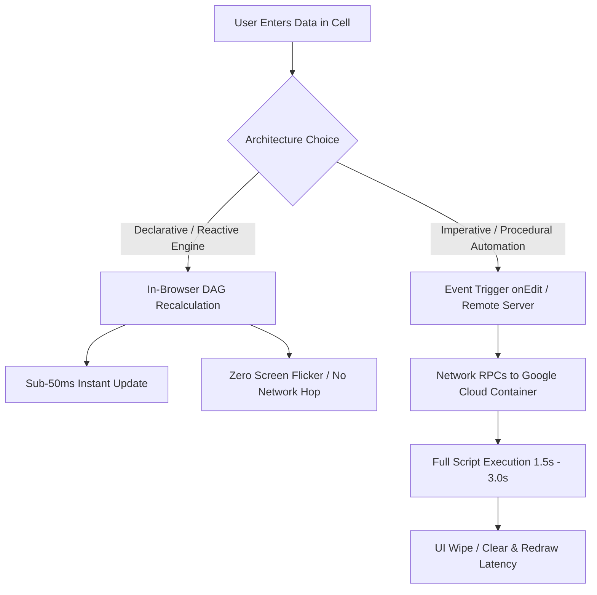

# Reactive-First Spreadsheet Architecture: Declarative Engine First, Procedural Fallback

This skill provides architectural standards and engineering guidelines for building high-performance, responsive spreadsheet applications (Google Sheets and Microsoft Excel). It establishes a strict **Reactive-First** design methodology: maximize in-browser, declarative calculation graphs before introducing procedural scripts.

---

## 1. Core Paradigm: Reactive vs. Procedural

Spreadsheet systems possess two fundamentally distinct execution models:



| Dimension | Reactive Engine (Formula-Driven) | Procedural Automation (Script-Driven) |
| :--- | :--- | :--- |
| **Execution Model** | **Declarative**: Declare *what* the result is based on inputs. | **Imperative**: Step-by-step procedural execution (`for`, `if`, `while`). |
| **Runtime Location** | **Client-Side / In-Browser**: Google Sheets WebAssembly engine. | **Server-Side Remote**: Apps Script V8 container in Google Cloud. |
| **Evaluation Graph** | **Directed Acyclic Graph (DAG)**: Only re-evaluates dirty nodes. | **Linear Script Execution**: Iterates data sets and calls sheet APIs. |
| **User Experience** | **Spontaneous (~10–50 ms)**, zero flicker, works offline/mobile. | **Delayed (~1.5–3.0 s)**, potential visual wipe/rewrite flicker. |

---

## 2. Phase 1: The Reactive-First Design Protocol

Whenever designing or refactoring a spreadsheet feature, **always implement Phase 1 first**:

### Step 1: Model the Layout with Native Formulas
Construct tables with stable headers and insert native formula expressions rather than generating cells procedurally:
- **Multi-Condition Aggregations**:
  ```excel
  =SUMIFS(Transactions!$F:$F, Transactions!$E:$E, $A4, Transactions!$C:$C, ">="&DATE(2026,8,31), Transactions!$C:$C, "<="&DATE(2026,9,30))
  ```
- **Relational Filtering & Spills**:
  ```excel
  =FILTER(Installments!$A:$H, (Installments!$I:$I=$A4) * (Installments!$K:$K="Active"))
  ```
- **Dynamic Scope & Modularity with `LET`**:
  ```excel
  =LET(
    startDate, DATE(2026, 8, 31),
    endDate, DATE(2026, 9, 30),
    person, $A4,
    SUMIFS(Transactions!$F:$F, Transactions!$E:$E, person, Transactions!$C:$C, ">="&startDate, Transactions!$C:$C, "<="&endDate)
  )
  ```
- **Array Transformations with `LAMBDA`, `MAP`, `BYROW`**:
  Use `BYROW` or `MAP` to perform row-level calculations across an entire table in a single top-left formula cell, eliminating formula dragging.

---

## 3. Phase 2: Feasibility & Boundary Checklist

Before writing any procedural script, evaluate whether formulas can accomplish the task. Move to **Phase 3 (Procedural Automation)** *only* if at least one boundary criterion below is met:

| Feasibility Check | Formula Engine Capable? | Transition to Script Required? |
| :--- | :---: | :---: |
| **Mathematical / Date / Text aggregation** (`SUMIFS`, `REGEX`, `EDATE`) | ✅ **YES** | ❌ No |
| **Cross-sheet relational lookups** (`XLOOKUP`, `FILTER`, `QUERY`) | ✅ **YES** | ❌ No |
| **Conditional row selection and totals** | ✅ **YES** | ❌ No |
| **External system integration** (Drive PDF ingestion, Gmail, Webhooks, APIs) | ❌ **NO** | ✅ **YES (Procedural)** |
| **Destructive / State-mutating actions** (Archiving files, moving rows, trash) | ❌ **NO** | ✅ **YES (Procedural)** |
| **Dynamic sheet creation / deletion** (Adding monthly tabs, deleting tabs) | ❌ **NO** | ✅ **YES (Procedural)** |
| **Session persistence / Script properties** (Storing reconciliation tokens) | ❌ **NO** | ✅ **YES (Procedural)** |
| **Formatting mutation** (Changing cell borders, backgrounds dynamically on edit) | ⚠️ Partial (Conditional Formatting) | ✅ **YES if complex** |

---

## 4. Phase 3: High-Performance Procedural Automation & The Hybrid Model

When procedural scripts (Apps Script / VBA) are strictly necessary, enforce the **Hybrid Model**:

### Rule 1: Never Wiping Active Views on Edit (`No sheet.clear()`)
- **Anti-Pattern**: Calling `sheet.clear()` inside an `onEdit` handler causes the screen to flash blank while the user is typing, creating a jarring experience.
- **Production Pattern**: Update data ranges **in-place** (`range.setValues(...)`). Leave headers, styling, and grid formatting permanent.

### Rule 2: Delegate Calculations to Native Formulas
- Even when using scripts to build monthly tables or archive cycles, **write formulas into the summary cells** (`=SUM(...)`, `=B4+C4`) rather than static numbers.
- When the user edits inputs, the native formula recalculates instantly in the browser without invoking the script engine.

### Rule 3: Decouple Heavy Audits from Live User Edits
- Lightweight triggers (`onEdit`) must ONLY refresh localized data or let formulas recalculate.
- Heavy procedural workflows (full PDF parsing, statement reconciliation, 3-sheet audit reports) must run on **explicit user triggers** (custom menu or daily time-driven triggers), never on every cell keystroke.

---

## 5. Engineering Decision Matrix

```
Requirement
├── Can it be calculated from existing cells?
│   ├── YES ──► Use Native Reactive Formulas (SUMIFS, FILTER, LET, QUERY)
│   │           └── Result: 0ms latency, zero screen flicker, offline support
│   │
│   └── NO (Requires external PDF, Drive, Gmail, or structural mutations)
│       └── Transition to Procedural Automation (Apps Script)
│           ├── Use In-Place Batch I/O (no sheet.clear())
│           ├── Write native formulas into summary cells
│           └── Run heavy reconciliation on-demand, not on every edit
```

---

## 6. Visual Ergonomics & Layout Fitting Standards

### Preventing Column A & Row 1 Distortion
When generating dashboards and financial tables with title banners:
1. **Never Call `sheet.autoResizeColumns(1, N)` across Merged Header Rows**:
   Merged cells (e.g. `A1:K1`) cause Google Sheets to blow out Column A to 400+ pixels wide.
   - Set Column A explicitly (`sheet.setColumnWidth(1, width)`).
   - Only auto-resize data columns starting from column 2 (`sheet.autoResizeColumns(2, N - 1)`).
2. **Explicit Row Heights for Banners**:
   - Title Banner Row 1: `30px` (or max `32px`).
   - Subtitle Row 2: `20px`.
   - Section header bars: `26px`.
   - Data rows: standard `21–23px`.
3. **Table Width Budgeting**:
   Multi-month matrix views must fit on standard desktop viewports (1280–1920px) without horizontal scrolling. Column widths for monthly cycles must be clamped to 100–115px.

---

## 7. Data Hygiene & Whitespace-Resilient Formulas

### The Trailing/Leading Whitespace Failure Mode
In Google Sheets declarative formulas (`SUMIFS`, `COUNTIF`, `MATCH`, `VLOOKUP`), string matching is exact unless explicit wildcards are configured:
- If a user enters `"Muhanad "` (with an accidental trailing space or non-breaking space `\u00A0`) in a raw transaction sheet, a standard formula:
  ```excel
  =SUMIFS(Transactions!$E:$E, Transactions!$D:$D, $A4, ...)
  ```
  evaluates `$A4 == "Muhanad"`, tests `"Muhanad " = "Muhanad"`, evaluates to `FALSE`, and silently drops the transactions from the calculation.
- The user sees an erroneous total in dashboards (e.g. `Monthly Overview` or `Debt Breakdown`) with zero formula errors reported by the spreadsheet engine.

### The 3-Layer Defense-in-Depth Pattern

To make financial spreadsheets completely impervious to stray spaces, enforce a 3-layer architecture:

#### Layer 1: Declarative Formula Resilience (Wildcard & TRIM Criteria)
Never use raw exact cell references in criteria arguments of `SUMIFS`, `COUNTIF`, or `MATCH` when matching user-typed names or categories:
- **Wrap criteria with wildcards (`*`) and `TRIM()`**:
  ```excel
  =SUMIFS(Transactions!$E:$E, Transactions!$D:$D, "*" & TRIM($A4) & "*", Transactions!$B:$B, ">="&DATE(2026,8,31), Transactions!$B:$B, "<="&DATE(2026,9,30))
  ```
  - In Google Sheets, `*` matches 0 or more characters, so `*Muhanad*` matches `"Muhanad"`, `"Muhanad "`, `" Muhanad"`, and `"  Muhanad  "` with sub-50ms instant recalculation.
  - As long as distinct entities do not share substring substrings (e.g. "Dad", "Mai", "Muhanad", "Abdo"), wildcard matching provides 100% collision-free resilience.

#### Layer 2: In-Place Real-Time Input Sanitization via `onEdit`
Catch and correct whitespace directly at the source when the user enters or pastes data into input sheets:
- Intercept the column in `onEdit(e)`:
  ```javascript
  if (sheetName === CONFIG.SHEETS.TRANSACTIONS) {
    const startCol = e.range.getColumn();
    const endCol = startCol + (e.range.getNumColumns ? e.range.getNumColumns() : 1) - 1;
    if (startCol <= 4 && endCol >= 4 && e.range.getLastRow() >= 2) {
      const startRow = Math.max(2, e.range.getRow());
      const numRows = e.range.getLastRow() - startRow + 1;
      const targetRange = sheet.getRange(startRow, 4, numRows, 1);
      const values = targetRange.getValues();
      let changed = false;
      for (let r = 0; r < values.length; r++) {
        const orig = String(values[r][0] || "");
        if (orig) {
          const clean = formatPayerCell(orig);
          if (clean !== orig) {
            values[r][0] = clean;
            changed = true;
          }
        }
      }
      if (changed) targetRange.setValues(values);
    }
    return;
  }
  ```
  - Replaces all unicode whitespace (`\u00A0` non-breaking spaces and regular spaces) and normalizes names to Title Case directly in the sheet cell without full sheet redraws.

#### Layer 3: Procedural Ingestion & Batch Self-Healing Sanitizer
1. **Batch Auto-Cleaner**: On every background sync or dashboard update, execute a batch cleaner:
   ```javascript
   function sanitizeAllPayerNames(ss) {
     // Scans Transactions Col D and Installments Col I, cleans whitespace and Title Cases dirty cells in-place
   }
   ```
2. **Defensive Procedural Reads**:
   Whenever scripts read user columns, immediately normalize whitespace and letter casing:
   ```javascript
   const cleanName = normalizePersonName(rawName);
   ```

---

### Case Sensitivity Rules: Declarative Engine vs Procedural Engine

| Aspect | Declarative Engine (Formulas) | Procedural Engine (Apps Script) |
| :--- | :--- | :--- |
| **Case Behavior** | **100% Case-Insensitive**: `SUMIFS`, `COUNTIF`, `MATCH`, `VLOOKUP`, `XLOOKUP` treat `"muhanad"`, `"Muhanad"`, and `"MUHANAD"` identically. | **Case-Sensitive by Default**: JavaScript `===` considers `"muhanad" !== "Muhanad"`. |
| **Impact on Calculations** | **None**: Lowercase or uppercase letters in input sheets match summary tables automatically. | **Requires Normalization**: Un-normalized keys would split dictionary buckets (`obj["muhanad"]` vs `obj["Muhanad"]`). |
| **Architectural Standard** | Use wildcard wrapping (`"*" & TRIM($A4) & "*"`) for whitespace resilience; case-insensitivity is built-in. | Always pipe through `normalizePersonName(val)` (lowercases input, maps aliases like `me` -> `Mido`, outputs canonical Title Case). |
| **In-Sheet Visual Cleanliness** | Automatic formatting via `onEdit` (`formatPayerCell`) auto-capitalizes cells into clean Title Case as the user types. | Batch self-healing (`sanitizeAllPayerNames`) ensures sheets maintain uniform casing. |


