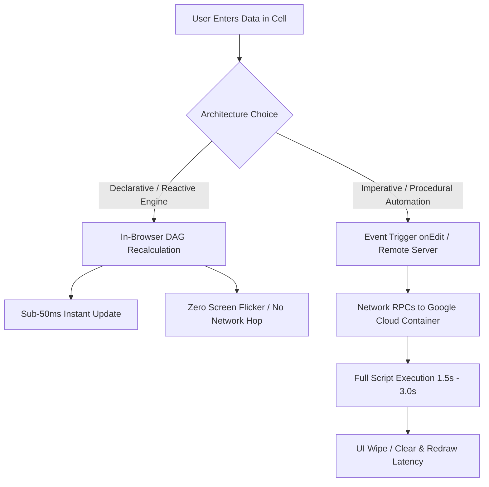

# Reactive-First Spreadsheet Architecture: Declarative Engine First, Procedural Fallback

This skill provides architectural standards and engineering guidelines for building high-performance, responsive spreadsheet applications (Google Sheets and Microsoft Excel). It establishes a strict **Reactive-First** design methodology: maximize in-browser, declarative calculation graphs before introducing procedural scripts.

---

## 1. Core Paradigm: Reactive vs. Procedural

Spreadsheet systems possess two fundamentally distinct execution models:



| Dimension | Reactive Engine (Formula-Driven) | Procedural Automation (Script-Driven) |
| :--- | :--- | :--- |
| **Execution Model** | **Declarative**: Declare *what* the result is based on inputs. | **Imperative**: Step-by-step procedural execution (`for`, `if`, `while`). |
| **Runtime Location** | **Client-Side / In-Browser**: Google Sheets WebAssembly engine. | **Server-Side Remote**: Apps Script V8 container in Google Cloud. |
| **Evaluation Graph** | **Directed Acyclic Graph (DAG)**: Only re-evaluates dirty nodes. | **Linear Script Execution**: Iterates data sets and calls sheet APIs. |
| **User Experience** | **Spontaneous (~10–50 ms)**, zero flicker, works offline/mobile. | **Delayed (~1.5–3.0 s)**, potential visual wipe/rewrite flicker. |

---

## 2. Phase 1: The Reactive-First Design Protocol

Whenever designing or refactoring a spreadsheet feature, **always implement Phase 1 first**:

### Step 1: Model the Layout with Native Formulas
Construct tables with stable headers and insert native formula expressions rather than generating cells procedurally:
- **Multi-Condition Aggregations**:
  ```excel
  =SUMIFS(Transactions!$F:$F, Transactions!$E:$E, $A4, Transactions!$C:$C, ">="&DATE(2026,8,31), Transactions!$C:$C, "<="&DATE(2026,9,30))
  ```
- **Relational Filtering & Spills**:
  ```excel
  =FILTER(Installments!$A:$H, (Installments!$I:$I=$A4) * (Installments!$K:$K="Active"))
  ```
- **Dynamic Scope & Modularity with `LET`**:
  ```excel
  =LET(
    startDate, DATE(2026, 8, 31),
    endDate, DATE(2026, 9, 30),
    person, $A4,
    SUMIFS(Transactions!$F:$F, Transactions!$E:$E, person, Transactions!$C:$C, ">="&startDate, Transactions!$C:$C, "<="&endDate)
  )
  ```
- **Array Transformations with `LAMBDA`, `MAP`, `BYROW`**:
  Use `BYROW` or `MAP` to perform row-level calculations across an entire table in a single top-left formula cell, eliminating formula dragging.

---

## 3. Phase 2: Feasibility & Boundary Checklist

Before writing any procedural script, evaluate whether formulas can accomplish the task. Move to **Phase 3 (Procedural Automation)** *only* if at least one boundary criterion below is met:

| Feasibility Check | Formula Engine Capable? | Transition to Script Required? |
| :--- | :---: | :---: |
| **Mathematical / Date / Text aggregation** (`SUMIFS`, `REGEX`, `EDATE`) | ✅ **YES** | ❌ No |
| **Cross-sheet relational lookups** (`XLOOKUP`, `FILTER`, `QUERY`) | ✅ **YES** | ❌ No |
| **Conditional row selection and totals** | ✅ **YES** | ❌ No |
| **External system integration** (Drive PDF ingestion, Gmail, Webhooks, APIs) | ❌ **NO** | ✅ **YES (Procedural)** |
| **Destructive / State-mutating actions** (Archiving files, moving rows, trash) | ❌ **NO** | ✅ **YES (Procedural)** |
| **Dynamic sheet creation / deletion** (Adding monthly tabs, deleting tabs) | ❌ **NO** | ✅ **YES (Procedural)** |
| **Session persistence / Script properties** (Storing reconciliation tokens) | ❌ **NO** | ✅ **YES (Procedural)** |
| **Formatting mutation** (Changing cell borders, backgrounds dynamically on edit) | ⚠️ Partial (Conditional Formatting) | ✅ **YES if complex** |

---

## 4. Phase 3: High-Performance Procedural Automation & The Hybrid Model

When procedural scripts (Apps Script / VBA) are strictly necessary, enforce the **Hybrid Model**:

### Rule 1: Never Wiping Active Views on Edit (`No sheet.clear()`)
- **Anti-Pattern**: Calling `sheet.clear()` inside an `onEdit` handler causes the screen to flash blank while the user is typing, creating a jarring experience.
- **Production Pattern**: Update data ranges **in-place** (`range.setValues(...)`). Leave headers, styling, and grid formatting permanent.

### Rule 2: Delegate Calculations to Native Formulas
- Even when using scripts to build monthly tables or archive cycles, **write formulas into the summary cells** (`=SUM(...)`, `=B4+C4`) rather than static numbers.
- When the user edits inputs, the native formula recalculates instantly in the browser without invoking the script engine.

### Rule 3: Decouple Heavy Audits from Live User Edits
- Lightweight triggers (`onEdit`) must ONLY refresh localized data or let formulas recalculate.
- Heavy procedural workflows (full PDF parsing, statement reconciliation, 3-sheet audit reports) must run on **explicit user triggers** (custom menu or daily time-driven triggers), never on every cell keystroke.

---

## 5. Engineering Decision Matrix

```
Requirement
├── Can it be calculated from existing cells?
│   ├── YES ──► Use Native Reactive Formulas (SUMIFS, FILTER, LET, QUERY)
│   │           └── Result: 0ms latency, zero screen flicker, offline support
│   │
│   └── NO (Requires external PDF, Drive, Gmail, or structural mutations)
│       └── Transition to Procedural Automation (Apps Script)
│           ├── Use In-Place Batch I/O (no sheet.clear())
│           ├── Write native formulas into summary cells
│           └── Run heavy reconciliation on-demand, not on every edit
```
